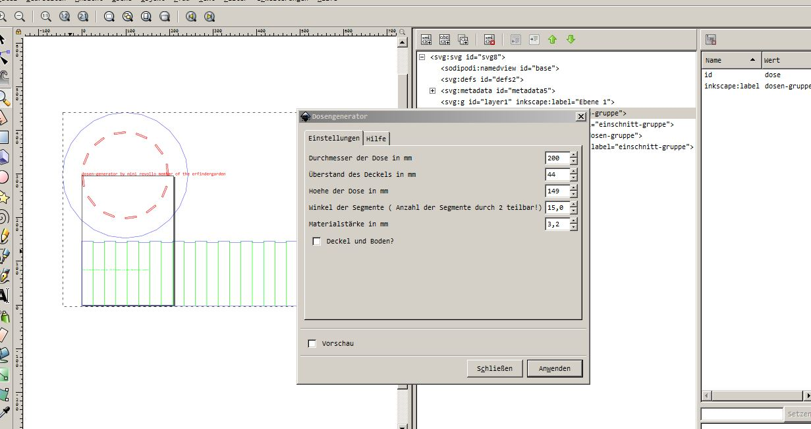
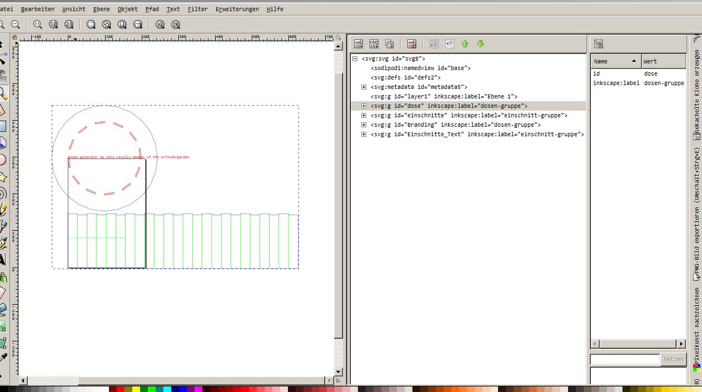

# Inkscape-Dosen-Generator

Eine **Erweiterung für Inkscape**, geschrieben in **Python** um eine Dose mit Fingerzinken für einen **Lasercutter** zu generieren. 

Um die Rundung für die Seite zu realisieren soll das Material entlang der grünen Pfade nicht durchgeschnitten sondern nur angeschnitten werden. Es bietet sich 3.6 mm Birkensperrholz an, das in drei Schichten gefertigt wird. Zwei der drei Schichten sollten eingeschnitten werden, **also 66 % der Materialstärke**. Die Einschnitte sind zwei Schnitte 0,2 mm nebeneinander. Bei einer Laserschnittbreite von ca. 0,15 mm ergibt das einen Einschnitt von ca. 0,4 bis 0,5 mm. Der **Faserverlauf** der verbleibenden Schicht sollte **quer** zu den Einschnitten verlaufen.

Im Programm werden die **Dimensionen** der Dose, die **Materialstärke** , ein gewünschter Deckelüberstand und der **Winkel der Kreissegmente** eingegeben.
Außerdem kann noch gewählt werden ob man **Boden und Deckel** haben möchte. Entsprechend wird dann die Seite mit zwei Zinkenreihen versehen.

----------

Es werden nur ein Deckel/Boden der Dose angezeigt. Für die komplette Dose müssen diese **zweimal** geschnitten werden. Man kann das Programm auch zweimal laufen lassen um unterschiedliche Überstände bei Boden und Deckel zu erzeugen. 

Auf den Flächen können nun auch noch Gravierungen oder Löcher eingearbeitet werden.

Im **XML Editor von Inkscape** kann man schön den Aufbau der SVG erkennen.

----------

----------
# Installation

Die beiden Dateien **dosengenerator.py** und **dosengenerator.inx** in den Ordner **...Programme/inkscape/share/extensions** kopieren und **Inkscape neu starten**.

